<a id="readme-top"></a>

<h1 align="center">Airbnb Clone</h1>


<p align="center">
  A full-stack Airbnb-style marketplace with a guest side (search, listing pages, booking) and a host side
  (listing wizard, calendar, reservations, messaging).
</p>

https://github.com/user-attachments/assets/db52e4c5-7eb2-487a-906e-a7460b0f4b66

<p align="center">
  
  
  
  
  
  
</p>

<p align="center">
  <a href="https://github.com/smriti-02/Airbnb-clone"><b>GitHub Repository</b></a> &nbsp;|&nbsp;
  <a href="#live-demo-and-quick-links"><b>Live Demo</b></a> &nbsp;|&nbsp;
  <a href="#system-architecture"><b>Architecture</b></a> &nbsp;|&nbsp;
  <a href="#database-design"><b>Database</b></a> &nbsp;|&nbsp;
  <a href="#getting-started"><b>Getting Started</b></a>
</p>

> **Disclaimer:** This is an educational project built for an internship assignment. It is not affiliated with, endorsed by, or connected to Airbnb in any way. All photos are sourced from Unsplash, and map data is provided by © OpenStreetMap contributors.

---

## Table of Contents

- [Overview](#overview)
- [Live demo and quick links](#live-demo-and-quick-links)
- [Features vs assignment requirements](#features-vs-assignment-requirements)
- [Tech stack](#tech-stack)
- [System architecture](#system-architecture)
  - [Data Flow Diagram](#dataflow-diagram)
  - [System flowchart](#system-flowchart)
  - [Backend layering](#backend-layering)
  - [Search request lifecycle](#search-request-lifecycle)
  - [Booking flow](#booking-flow)
  - [Deployment diagram](#deployment-diagram)
  - [Architecture decisions](#architecture-decisions)
- [Project structure](#project-structure)
- [Database design](#database-design)
  - [ER diagram](#er-diagram)
  - [Table descriptions](#table-descriptions)
  - [Integrity rules](#integrity-rules)
  - [PostgreSQL protections](#postgresql-protections)
  - [Schema creation and data loading](#schema-creation-and-data-loading)
- [Core business logic](#core-business-logic)
  - [Search and filtering](#search-and-filtering)
  - [Availability rule](#availability-rule)
  - [Pricing service](#pricing-service)
  - [Host listing lifecycle](#host-listing-lifecycle)
  - [Messaging](#messaging)
- [API overview](#api-overview)
- [Frontend architecture](#frontend-architecture)
- [Getting started](#getting-started)
  - [Prerequisites](#prerequisites)
  - [Clone the repository](#clone-the-repository)
  - [Run the backend](#run-the-backend)
  - [Run the frontend](#run-the-frontend)
  - [Try it out](#try-it-out)
  - [Demo accounts](#demo-accounts)
- [Environment variables](#environment-variables)
- [Testing](#testing)
- [Deployment](#deployment)
- [Assumptions and mocked parts](#assumptions-and-mocked-parts)
- [Security notes](#security-notes)
- [Known limitations and future improvements](#known-limitations-and-future-improvements)
- [Troubleshooting](#troubleshooting)
- [Credits and notes](#credits-and-notes)

---

## Overview

The application provides two distinct flows:

| | Guest | Host |
| :--- | :--- | :--- |
| **Discover** | Browse listings on a map and in a grid, filter by location, dates, guests and property type | Create listings through a step-by-step wizard |
| **Decide** | View photo galleries, amenities, host details, reviews and an availability calendar | Set pricing, block dates and review reservations on a dashboard |
| **Act** | Get a live price breakdown and book dates that do not overlap with other stays | Manage listings and reservations |
| **Stay in touch** | Save favourites to a wishlist and message the host | Reply to guests through the built-in messaging inbox |

> [!TIP]
> **Evaluator quick path (about 2 minutes):** open the frontend, use the profile menu and choose **Switch user** to log in as a demo guest, search a city and book a stay, then switch to a demo host to see the reservation on the host dashboard. No passwords are needed. Details are in [Try it out](#try-it-out).

### Screenshots

Screenshots are not committed yet. Add the images to `docs/screenshots/` and uncomment the table below.

<!--
| Home and search | Listing detail |
| :---: | :---: |
|  |  |

| Booking summary | My trips |
| :---: | :---: |
|  |  |

| Host wizard | Host dashboard |
| :---: | :---: |
|  |  |
-->

<p align="right"><a href="#readme-top">Back to top</a></p>

---

## Live demo and quick links

| Resource | Link |
| :--- | :--- |
| **GitHub repository** | [github.com/smriti-02/Airbnb-clone](https://github.com/smriti-02/Airbnb-clone) |
| **Frontend web app** | [Vercel](https://airbnb-clone-iota-ten-99.vercel.app/) |
| **Backend API base** | [Render](https://airbnb-clone-ho22.onrender.com) |

> [!NOTE]
> The backend runs on a free tier. After a period of inactivity the first API request can take up to 60 seconds while the server wakes up. Open the site once and wait a moment before testing.

<p align="right"><a href="#readme-top">Back to top</a></p>

---

## Features vs assignment requirements

| Requirement | What was built | Where in the code | Status |
| :--- | :--- | :--- | :---: |
| **Home and search** (grid, search bar, category row, pagination) | Search bar with location and date filters, a category row and a listing grid. Infinite scroll / pagination is currently mocked or partial. | `frontend/src/components/SearchBarExpanded.tsx`, `backend/routers/listings.py` | Partial |
| **Listing detail** (gallery, amenities, host, calendar, price, reviews) | Photo gallery, amenities list, availability calendar, dynamic price breakdown and review list. | `frontend/src/app/listings/[id]/page.tsx`, `backend/models/models.py` | Done |
| **Booking flow** (validation, overlaps, summary, checkout, trips, persistence) | Validates dates and guests, prevents overlapping bookings through SQLAlchemy events and calculates totals. Checkout itself is mocked. | `backend/models/models.py` (overlap event), `backend/routers/bookings.py` | Done (checkout mocked) |
| **Host CRUD** (create, edit, delete, dashboard, bookings) | Multi-step wizard to create listings, a dashboard showing listing status, edit forms and a reservations view. | `frontend/src/app/become-a-host/signup/page.tsx`, `backend/routers/host.py` | Done |
| **Airbnb experience** (navigation, modals, toasts, wishlist) | Header that shrinks on scroll, wishlists through `WishlistContext`, filter modals and toast notifications. | `frontend/src/components/Header.tsx`, `frontend/src/contexts/WishlistContext.tsx` | Done |
| **Mocked sections** (payments, messaging, map, identity, auth) | Payments bypassed, messaging via polling, Leaflet map, identity verified automatically, auth via the `X-User-Id` header. | `frontend/src/lib/api.ts`, `backend/routers/auth.py` | Mocked |
| **Bonuses** (interactive map, reviews, Superhost, upload, dark mode, responsive) | Interactive Leaflet map, post-stay reviews and image upload to the backend disk. Dark mode is **not built**. Responsive design is partial. | `frontend/src/components/HomeMap.tsx`, `backend/routers/host.py` | Partial / Not built |

<p align="right"><a href="#readme-top">Back to top</a></p>

---

## Tech stack

| Layer | Technology | Why it was chosen |
| :--- | :--- | :--- |
| **Frontend framework** | Next.js (App Router) | File-based routing, shared layouts and fast React rendering. |
| **Language** | TypeScript | Strong typing across the frontend catches mistakes before runtime. |
| **Styling** | Tailwind CSS | Rapid utility-first styling without leaving the markup. |
| **Backend framework** | FastAPI | High performance, automatic OpenAPI documentation and readable Python. |
| **ORM** | SQLAlchemy | Mature ORM for relationships, constraints and event hooks. |
| **Validation** | Pydantic | Strict request validation and response serialization. |
| **Database** | PostgreSQL (Neon) and SQLite | SQLite for local development and tests, PostgreSQL on Neon for hosted use. |
| **Testing** | pytest | Fixtures and clear syntax for backend unit and integration tests. |
| **Maps** | Leaflet and OpenStreetMap | Open source and no API key, used through `react-leaflet`. |

<p align="right"><a href="#readme-top">Back to top</a></p>

---

## System architecture

### Data flow diagrams

Level 0 (context):

<p align="center"> 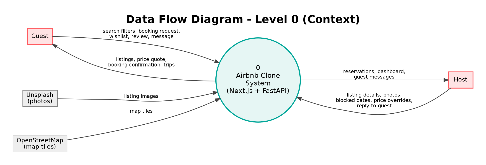 </p>

Level 1:

<p align="center"> 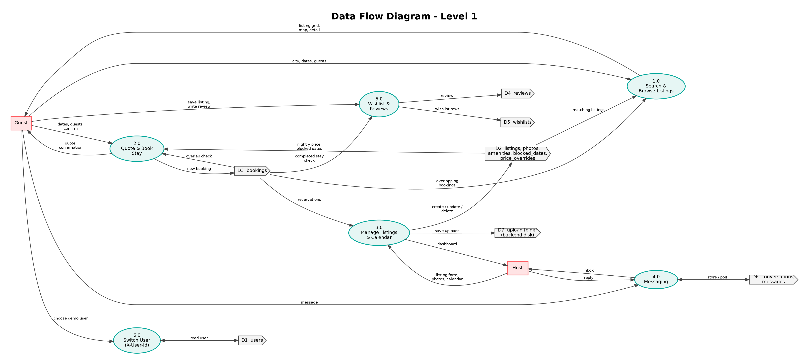 </p>

Circles are processes, boxes are external entities, and the open-ended shapes (D1 to D7) are data stores.

### System flowchart

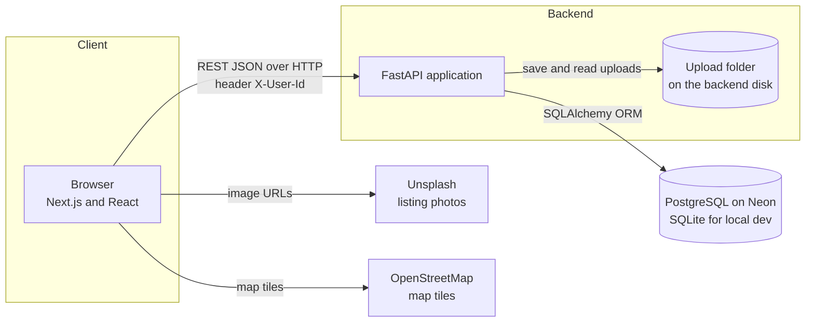

*The browser talks to the FastAPI backend for data, loads listing photos from Unsplash (or from the backend's upload folder) and map tiles directly from OpenStreetMap.*

### Backend layering

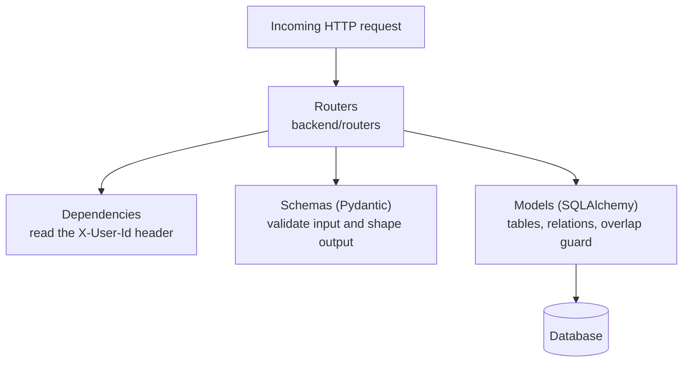

- **Routers** (`backend/routers/`) parse requests, validate payloads and define HTTP responses.
- **Dependencies** (`backend/dependencies.py`) extract the `X-User-Id` header to identify the active user.
- **Models** (`backend/models/models.py`) define the database schema and ORM relationships.
- **Schemas** (`backend/schemas/`) are Pydantic models that validate input and serialize output.

*Business logic mostly lives in the router endpoints, which rely on SQLAlchemy queries and model events to enforce state.*

### Search request lifecycle

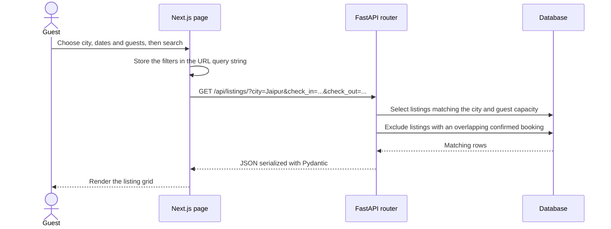

*Example: `GET /api/listings/?city=Jaipur&check_in=...` filters the `listings` table by `city`, removes any listing that has an overlapping `confirmed` booking for the requested dates, and returns the remaining rows as JSON.*

### Booking flow

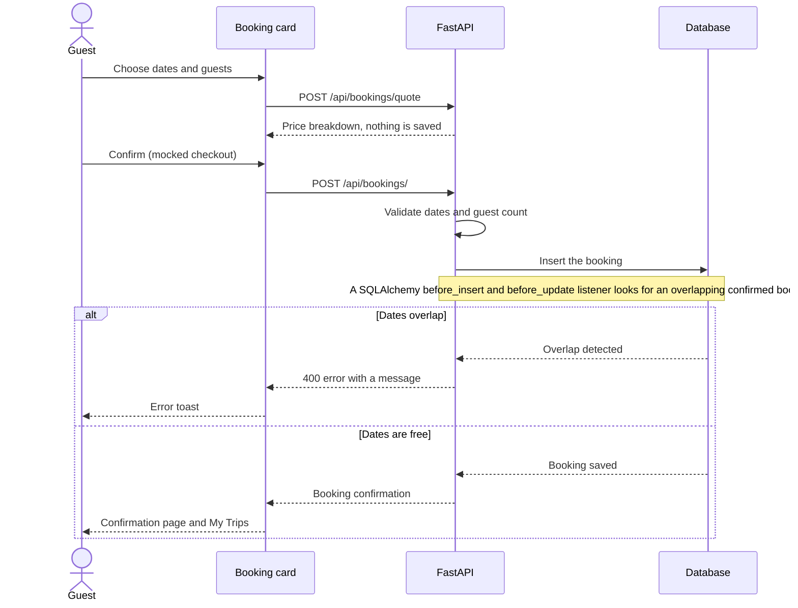

*The price is always computed on the server. The overlap check happens when the booking is written, so two guests cannot hold the same dates.*

### Deployment diagram

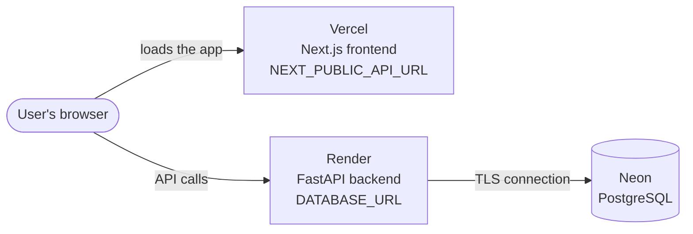

*Vercel serves the Next.js app. The browser then calls the FastAPI backend on Render, which reads and writes a Neon PostgreSQL database.*

### Architecture decisions

| Decision | Reason |
| :--- | :--- |
| **URL query string as the source of truth for search** | Location, dates and guests live in the URL, so search results are shareable and the browser back button works. |
| **Prices computed on the server** | The total is calculated by the backend, so a client cannot tamper with it. |
| **Polling instead of WebSockets** | Messaging uses simple HTTP polling, which keeps deployment on free hosting platforms simple. |
| **Frozen seed data** | The database starts from fixed JSON files, so the app is populated with consistent data and nothing is scraped at runtime. |
| **Mocked authentication** | A user switcher and the `X-User-Id` header keep the focus on the marketplace features. See [Security notes](#security-notes). |

<p align="right"><a href="#readme-top">Back to top</a></p>

---

## Project structure

```text
Airbnb-clone/
├── backend/
│   ├── main.py              # FastAPI application entry point
│   ├── database.py          # SQLAlchemy engine and session setup
│   ├── dependencies.py      # Reads the X-User-Id header
│   ├── models/              # SQLAlchemy ORM models
│   ├── routers/             # API route handlers (listings, bookings, auth, host, messages)
│   ├── schemas/             # Pydantic validation schemas
│   ├── scripts/             # Utility scripts for data generation
│   ├── seed_data/           # JSON files with the frozen seed content
│   └── tests/               # Pytest suite
└── frontend/
    ├── src/
    │   ├── app/             # Next.js App Router pages and layouts
    │   ├── components/      # Reusable React components (UI, search, maps)
    │   ├── contexts/        # React Context providers (user, wishlist)
    │   └── lib/             # API client, utilities and types
    ├── package.json         # Dependencies and build scripts
    └── next.config.ts       # Next.js configuration and image domains
```

<p align="right"><a href="#readme-top">Back to top</a></p>

---

## Database design

### ER diagram

<p align="center"> 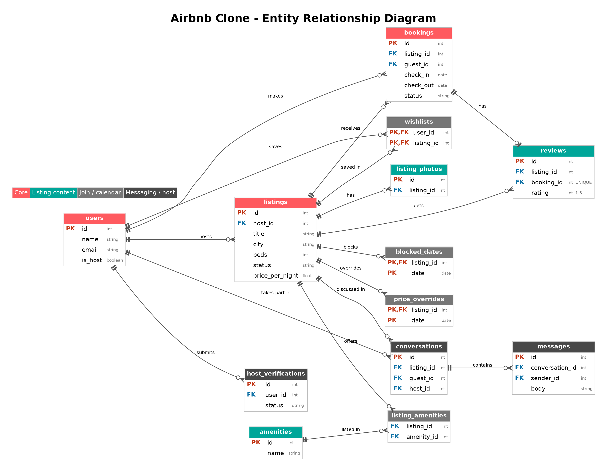 </p>

Crow's-foot notation: || = exactly one, o< = zero or many. PK = primary key, FK = foreign key. Vector version: er-diagram.svg.

*The core of the schema: users own listings, guests make bookings against listings, and reviews, wishlists, messages and host tools hang off those two tables. Only the main columns are shown.*

### Table descriptions

<details>
<summary><b>Click to expand table details</b></summary>

| Table | Purpose |
| :--- | :--- |
| `users` | Guests and hosts. The `is_host` flag separates the two roles. |
| `listings` | Property details, coordinates, pricing and wizard status. `host_id` cascades on delete. |
| `bookings` | Reservations with `check_in`, `check_out` and `status`. A CHECK constraint enforces `check_out > check_in`. |
| `reviews` | Guest feedback. Limited to one review per `booking_id`. The rating is constrained to 1 to 5 by a CHECK constraint. |
| `listing_photos`, `amenities`, `listing_amenities` | Photos and the many-to-many amenity relationship used by listing pages. |
| `wishlists` | Saved listings per user, with the composite key `(user_id, listing_id)`. |
| `conversations`, `messages` | Host and guest chat. A unique constraint on `(listing_id, guest_id)` keeps one conversation per guest per listing. |
| `blocked_dates`, `price_overrides` | Lets hosts block dates and set custom prices for specific dates. |
| `host_verifications` | Mocked identity verification status for hosts. |

</details>

### Integrity rules

- **No overlapping bookings:** date ranges are half-open, `[check_in, check_out)`. Cancelled bookings are ignored, and a guest may check in on the day another guest checks out.
- **Composite keys:** wishlists use `(user_id, listing_id)` and blocked dates use `(listing_id, date)`.
- **One review per booking:** enforced by a `UNIQUE` constraint on `booking_id` in the `reviews` table.
- **Valid ranges:** `check_out > check_in` and ratings between 1 and 5 are enforced by CHECK constraints.

### PostgreSQL protections

> [!NOTE]
> Advanced PostgreSQL features such as `EXCLUDE USING GIST` constraints or explicit `FOR UPDATE` row locking are **not implemented** in the current code. Overlap protection is handled at the application level by a SQLAlchemy `before_insert` / `before_update` event listener that queries for overlapping dates before the booking is committed.

### Schema creation and data loading

- The schema is generated automatically by SQLAlchemy's `Base.metadata.create_all`.
- The project uses a **frozen seed**. On startup, if the `listings` table is empty, the application reads the JSON files in `backend/seed_data/` and inserts the demo data below.
- A SQLite-to-PostgreSQL copy script and a sequence-reset helper are not part of the repository.

| Seeded entity | Count |
| :--- | :---: |
| Users | 8 |
| Listings | 65 |
| Bookings | 134 |
| Reviews | 104 |

<p align="right"><a href="#readme-top">Back to top</a></p>

---

## Core business logic

### Search and filtering

Searches filter by `city` using exact matches, check guest capacity (`beds >= requested guests`) and exclude listings that have an overlapping confirmed booking, using SQLAlchemy subqueries. The search state lives in the URL, so a copied link reproduces the same results.

### Availability rule

A booking is rejected when this count is greater than zero:

```text
count(existing bookings
      where status = 'confirmed'
        and existing.check_in  < new.check_out
        and existing.check_out > new.check_in) > 0
```

Because the ranges are half-open, back-to-back stays on the same day are allowed.

### Pricing service

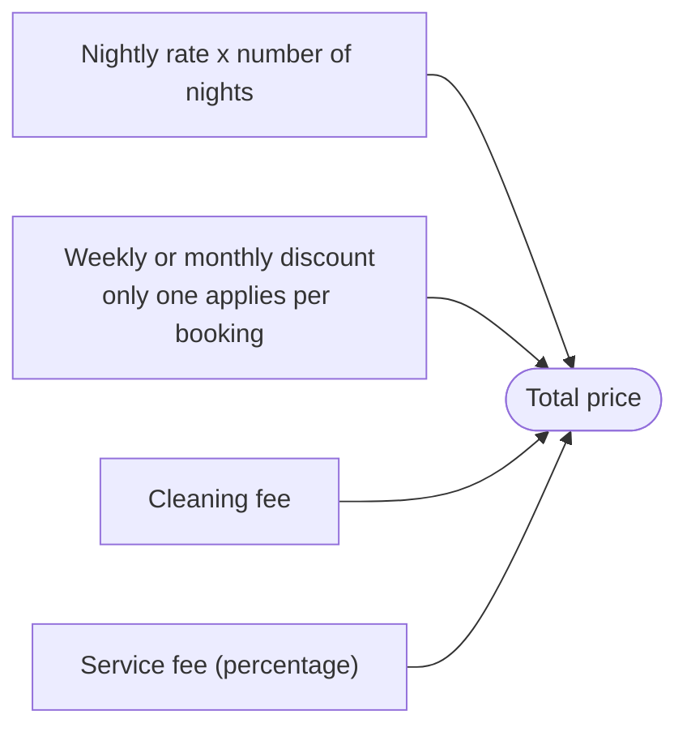

*The base nightly rate is multiplied by the length of stay. Cleaning fees and percentage-based service fees are applied, and weekly or monthly discounts are calculated in the same service to produce the final `total`. All amounts are in Indian rupees.*

### Host listing lifecycle

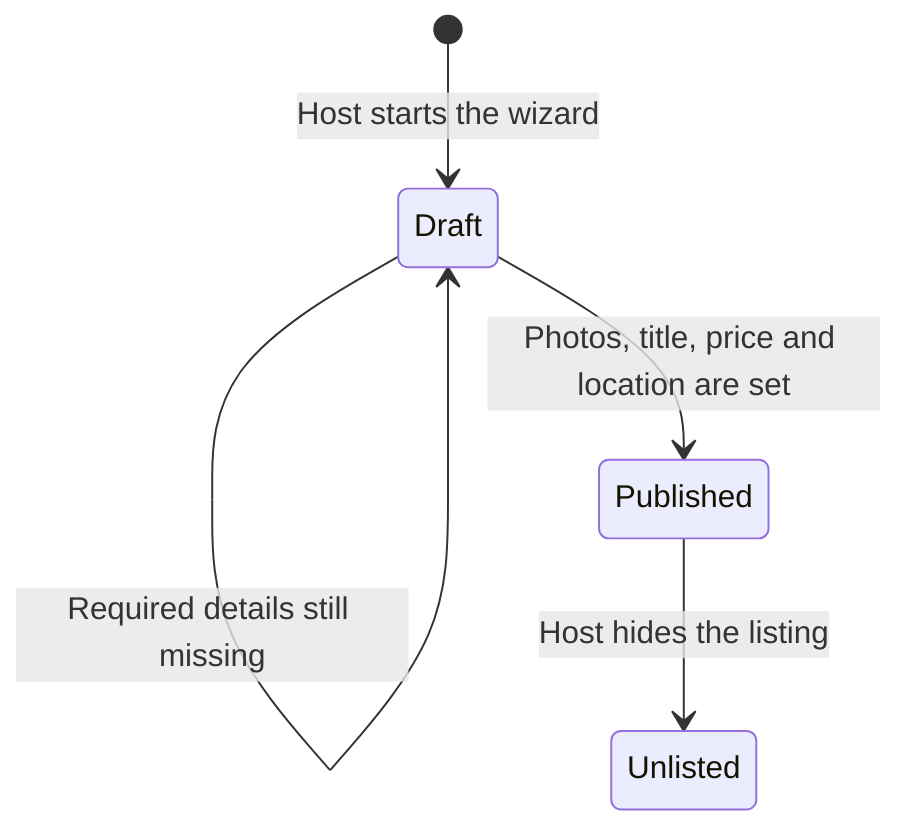

*A listing starts as a draft in the multi-step wizard and can only be published once the required details are present.*

### Messaging

Users communicate inside a `Conversation`. The frontend polls the messages endpoints to fetch new messages.

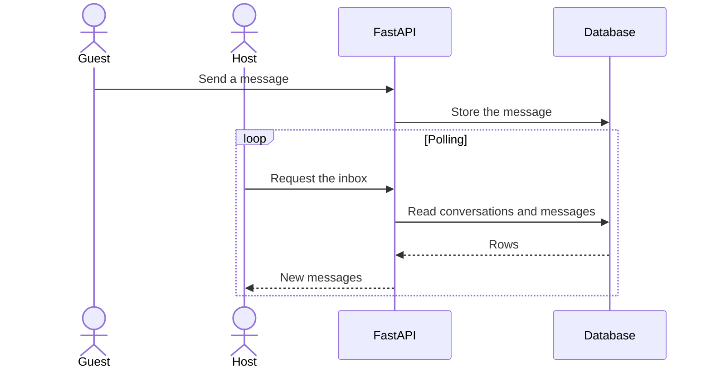

*Polling keeps the setup simple and works on free hosting. A WebSocket or server-sent events design is listed under [future improvements](#known-limitations-and-future-improvements).*

<p align="right"><a href="#readme-top">Back to top</a></p>

---

## API overview

**Conventions**

- The base path is `/api`.
- Authentication is mocked. Send a valid user ID in the `X-User-Id` HTTP header (for example `1` for Aarav, `5` for Vikram).
- Status codes: `200` success, `400` bad request (for example a booking overlap), `401` / `403` missing or invalid header, `404` not found, `422` validation error.
- The full, always-current list of endpoints is in the interactive docs at `/docs` (Swagger UI).

<details>
<summary><b>Click to view the endpoints table</b></summary>

| Method | Path | Caller | Description |
| :--- | :--- | :--- | :--- |
| | **Listings and search** | | |
| GET | `/api/listings/` | Anyone | Search properties (params: `city`, `check_in`, `check_out`, `guests`) |
| GET | `/api/listings/{id}` | Anyone | Get listing details and photos |
| | **Bookings** | | |
| POST | `/api/bookings/quote` | Anyone | Calculate the price without saving |
| POST | `/api/bookings/` | Guest | Create a new booking |
| GET | `/api/bookings/my-trips` | Guest | Get upcoming and past trips |
| | **Host** | | |
| POST | `/api/host/listings/` | Host | Create a draft listing |
| GET | `/api/host/dashboard` | Host | Get host stats and active listings |
| POST | `/api/host/listings/{id}/photos/` | Host | Upload a photo to the backend disk |
| GET | `/api/host/calendar/{id}` | Host | Get bookings and blocked dates |
| | **Messaging** | | |
| GET | `/api/messages/inbox` | Any user | List the user's conversations |
| POST | `/api/messages/{id}` | Any user | Send a message to a conversation |

</details>

**Example requests**

```bash
# Search stays in Jaipur for 2 guests
curl "http://localhost:8000/api/listings/?city=Jaipur&check_in=2026-11-10&check_out=2026-11-13&guests=2"

# List the trips of user 5 (Vikram Reddy, a demo guest)
curl -H "X-User-Id: 5" http://localhost:8000/api/bookings/my-trips
```

<p align="right"><a href="#readme-top">Back to top</a></p>

---

## Frontend architecture

| Path | Purpose | Role |
| :--- | :--- | :---: |
| `/` | Home page, search grid and category row | Guest |
| `/listings/[id]` | Listing detail, gallery and booking box | Guest |
| `/trips` | Manage existing bookings | Guest |
| `/become-a-host/signup` | Multi-step listing wizard | Host |
| `/host/dashboard` | Stats, reservations and listing table | Host |
| `/messages` | Unified chat inbox | Both |

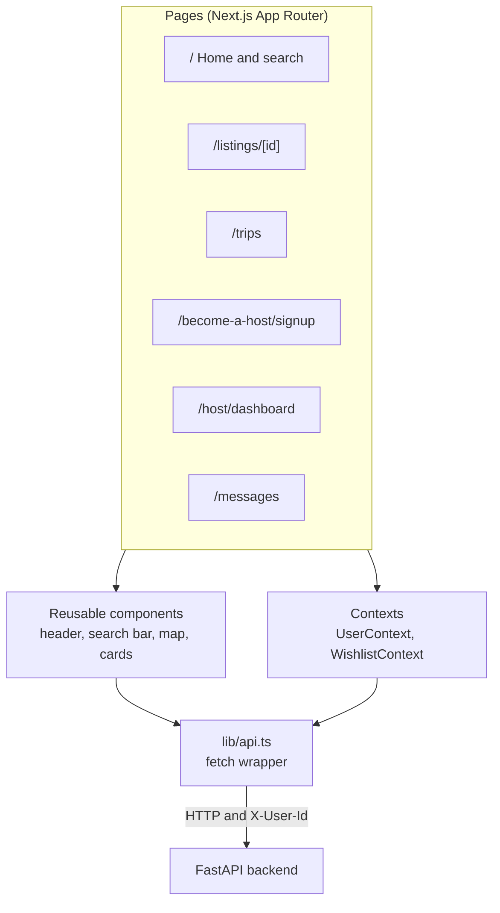

*Pages are composed from shared components. Global state (the active user and wishlist) lives in React Context, and every request goes through one API client.*

- **State strategy:** URL query parameters hold the search state. React Context (`UserContext`, `WishlistContext`) holds global application state.
- **Data fetching:** the standard `fetch()` API wrapped in small utility functions in `frontend/src/lib/`.
- **Header scroll behavior:** the header switches between an expanded and a compact state as the page scrolls. It uses different thresholds for collapsing and expanding (hysteresis) so it does not flicker near the switch point.

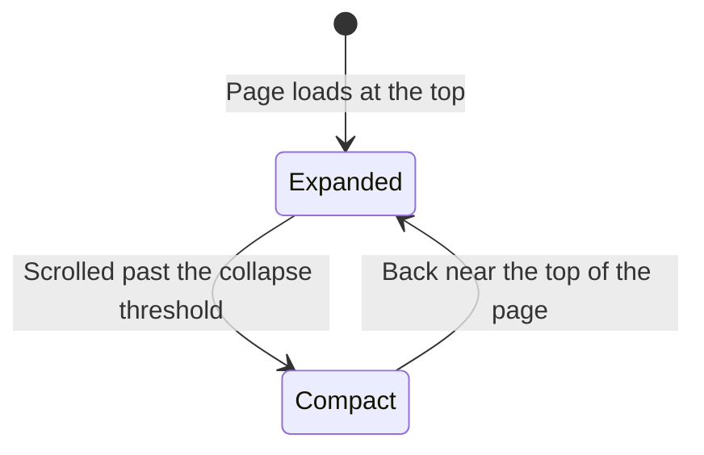

- **Design:** styled with Tailwind CSS. Dark mode and deep mobile responsiveness are not fully implemented.

<p align="right"><a href="#readme-top">Back to top</a></p>

---

## Getting started

### Prerequisites

- Python 3.10 or newer (a recent LTS release)
- Node.js 18 or newer (a recent LTS release)
- Git

### Clone the repository

```bash
git clone https://github.com/smriti-02/Airbnb-clone.git
cd Airbnb-clone
```

### Run the backend

By default the backend uses a local SQLite file (`airbnb_clone.db`). To use PostgreSQL, such as a Neon database, set `DATABASE_URL` in `backend/.env` (see [Environment variables](#environment-variables)).

**macOS / Linux**

```bash
cd backend
python3 -m venv venv
source venv/bin/activate
pip install -r requirements.txt
cp .env.example .env
uvicorn main:app --reload
```

**Windows (PowerShell)**

```powershell
cd backend
python -m venv venv
.\venv\Scripts\Activate
pip install -r requirements.txt
Copy-Item .env.example .env
uvicorn main:app --reload
```

The database seeds itself with the demo data on the first run. Check that the server is up at <http://localhost:8000/health> and browse the API at <http://localhost:8000/docs>.

### Run the frontend

Open a second terminal:

```bash
cd frontend
npm install
```

Create `frontend/.env.local` with the backend address, then start the dev server:

```bash
echo "NEXT_PUBLIC_API_URL=http://localhost:8000" > .env.local
npm run dev
```

On Windows PowerShell use `Set-Content .env.local "NEXT_PUBLIC_API_URL=http://localhost:8000"` instead of `echo`. Then open <http://localhost:3000>.

### Try it out

1. Open the frontend and use the profile menu to switch the active user to **Vikram Reddy** (guest).
2. Search for a location and dates, open a listing and book a stay.
3. Open **Trips** to see the booking.
4. Switch the user to **Aarav Sharma** (host) and find the reservation in the host dashboard.

> [!NOTE]
> The mock OTP for any authentication flow is `123456`, as defined in the backend config.

### Demo accounts

There are no passwords. Pick a user from the user switcher.

| Name | Role | Email |
| :--- | :---: | :--- |
| Aarav Sharma | Host | aarav@example.com |
| Priya Patel | Host | priya@example.com |
| Vikram Reddy | Guest | vikram@example.com |
| Neha Gupta | Guest | neha@example.com |

The seed data contains 8 users in total. The rest are in `backend/seed_data/`.

<p align="right"><a href="#readme-top">Back to top</a></p>

---

## Environment variables

<details>
<summary><b>Backend (<code>backend/.env</code>)</b></summary>

| Name | Required | Default / example | Purpose |
| :--- | :---: | :--- | :--- |
| `DATABASE_URL` | Yes | `sqlite:///./airbnb_clone.db` | Connection string for SQLAlchemy |
| `MOCK_OTP` | No | `123456` | Static OTP bypass code |
| `PUBLIC_BASE_URL` | No | `http://localhost:8000` | Base URL used to build links to uploaded files |

</details>

<details>
<summary><b>Frontend (<code>frontend/.env.local</code>)</b></summary>

| Name | Required | Default / example | Purpose |
| :--- | :---: | :--- | :--- |
| `NEXT_PUBLIC_API_URL` | Yes | `http://localhost:8000` | Points the React client at the FastAPI backend |

</details>

Never commit real `.env` files or database passwords. Only the `.env.example` templates belong in the repository.

---

## Testing

The backend has a pytest suite (`test_api.py`, `test_host.py`, `test_search.py`, `test_messages.py` and more).

```bash
cd backend
pytest
```

- **In-memory safety:** `conftest.py` contains a guard (`guard_in_memory_db`) that forces `DATABASE_URL = "sqlite:///:memory:"`, so tests never write to your real database file.
- An optional PostgreSQL test run with `TEST_DATABASE_URL` is not built.

---

## Deployment

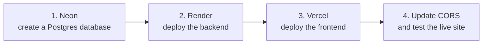

1. **Neon (database):** provision a serverless Postgres instance and copy the connection string into the backend's `DATABASE_URL`.
2. **Render (backend):** create a Web Service with root directory `backend`.
   - Start command: `uvicorn main:app --host 0.0.0.0 --port $PORT`
   - Health check path: `/api/misc/health`
   - Environment: set `DATABASE_URL`.
3. **Vercel (frontend):** import the repository, set the root directory to `frontend` and set `NEXT_PUBLIC_API_URL` to your Render URL.
4. **CORS:** make sure the frontend URL is allowed by the backend (see [Troubleshooting](#troubleshooting)), then open the live site and run through the [quick path](#overview).

**Caveats**

- Render's free tier sleeps after inactivity, so the first request can take around 60 seconds.
- Photos uploaded to the backend disk are lost on redeploy because the disk is ephemeral. Photos referenced by Unsplash URLs persist.

<p align="right"><a href="#readme-top">Back to top</a></p>

---

## Assumptions and mocked parts

| Area | What is assumed or mocked |
| :--- | :--- |
| **Authentication** | Bypassed. Identity is trusted from the plain `X-User-Id` header, and the OTP is a static code. |
| **Payments** | Checkout assumes an instant successful payment. No payment gateway is integrated. |
| **Identity verification** | Document uploads are accepted and immediately discarded. The status is mocked. |
| **Messaging** | Built with HTTP polling rather than WebSockets. |
| **Maps** | Leaflet draws the map from static latitude and longitude values. Address-to-coordinates geocoding is mocked. |
| **Capacity** | Guest capacity filtering checks `beds >= guests`. |
| **Pricing** | Prices are in Indian rupees. Only one discount applies per booking. |
| **Data** | All users, listings, bookings and reviews are fictional seed data. |

---

## Security notes

> [!WARNING]
> This application is for demonstration only. Do not use this authentication model in production.

- `X-User-Id` lets anyone impersonate any user. A real deployment needs JWT sessions or OAuth (for example NextAuth or Auth0).
- Uploads are validated minimally. A production app needs strict MIME-type checks and virus scanning.
- Rate limiting is not implemented.

---

## Known limitations and future improvements

| Area | Today | Next step |
| :--- | :--- | :--- |
| **Authentication** | Mock header | Secure JWT sessions or OAuth |
| **Messaging** | HTTP polling | WebSockets or server-sent events with pub/sub |
| **Image storage** | Local backend disk | Cloud storage such as S3 or Cloudinary, so uploads survive redeploys |
| **Schema changes** | `create_all` on startup | Alembic migrations |
| **Search** | Exact city match | Full-text search with `pg_trgm` or a search engine |
| **Performance** | No caching | Redis for frequent location queries |
| **Booking safety** | Application-level overlap check | PostgreSQL exclusion constraint and row locking |
| **UI** | Partial responsiveness, no dark mode | Full responsive pass and a dark theme |

<p align="right"><a href="#readme-top">Back to top</a></p>

---

## Troubleshooting

| Symptom | Likely cause | Fix |
| :--- | :--- | :--- |
| **CORS errors in the browser** | The frontend URL is not in the backend's `allow_origins` list | Use the exact URL, with no trailing slash, in `backend/main.py`. |
| **Empty results, nothing loads** | The database was not seeded or the backend failed on startup | Read the backend console output and make sure it started without errors. |
| **Images do not load** | The image domain is not allowed by Next.js | Add the domain (for example `images.unsplash.com`) to `images.remotePatterns` in `frontend/next.config.ts`. |
| **Database locked or duplicate key errors** | SQLite handles heavy concurrency poorly | Run the API tests sequentially, or use PostgreSQL. |
| **Frontend cannot reach the API** | `NEXT_PUBLIC_API_URL` is missing or wrong | Set it in `frontend/.env.local` and restart `npm run dev`. |
| **`ModuleNotFoundError` in the backend** | The virtual environment is not active | Activate `venv` and run `pip install -r requirements.txt`. |
| **Port already in use** | Another process uses 8000 or 3000 | Stop it, or start uvicorn with `--port 8001` and update `NEXT_PUBLIC_API_URL`. |
| **Slow first request online** | Free-tier hosting is waking up | Wait up to about a minute, then retry. |

---

## Credits and notes

- **Author:** [@smriti-02](https://github.com/smriti-02)
- **AI assistance:** AI coding tools were used during development, as permitted by the assignment brief.
- **Imagery:** property photos come from Unsplash.
- **Map data:** © OpenStreetMap contributors.
- **Educational use:** this software is provided as-is for educational purposes.

<p align="center">
  <a href="#readme-top">Back to top</a> &nbsp;|&nbsp;
  <a href="https://github.com/smriti-02/Airbnb-clone">View the repository</a>
</p>
