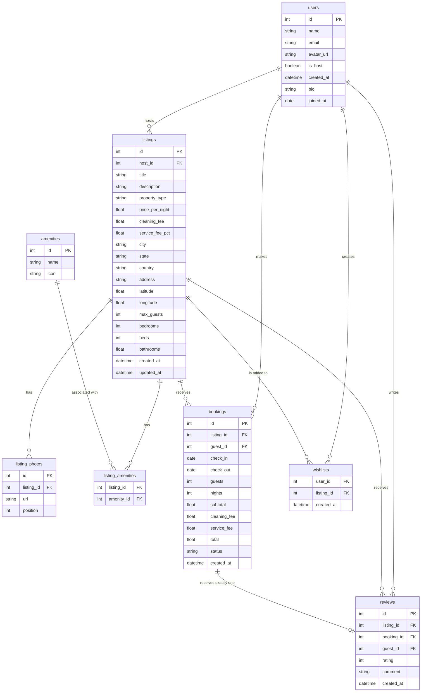

# Airbnb Clone Schema Documentation

## Entity-Relationship Diagram

## Relationships Explained

1. **User ↔ Listing (1:N)**: A user (host) can own multiple listings. This is defined by `Listing.host_id`. Cascades on delete.
2. **User ↔ Booking (1:N)**: A user (guest) can make multiple bookings. This is defined by `Booking.guest_id`.
3. **Listing ↔ Photo (1:N)**: A listing can have multiple photos, tracked by `listing_photos`. The order is determined by `position`.
4. **Listing ↔ Amenity (N:M)**: A listing can have multiple amenities (e.g., Wifi, Pool) and an amenity applies to many listings. Supported via the `listing_amenities` association table.
5. **Listing ↔ Booking (1:N)**: A listing can have many bookings over time. Handled by `Booking.listing_id`.
6. **Booking ↔ Review (1:1)**: A booking can only have one review. Handled by the `UNIQUE` constraint on `Review.booking_id`.
7. **Listing ↔ Review (1:N)**: Denormalized for quick fetching. Reviews belong to listings (and users), linked to bookings.
8. **User ↔ Wishlist ↔ Listing (N:M)**: A user can wishlist multiple listings, and a listing can be wishlisted by many users. Using composite primary key (`user_id`, `listing_id`).
